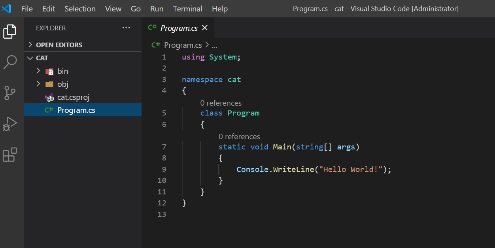

# Tabla de Contenidos
  1. [Introducción](#introducción)
    2. [Usar C# con Visual Studio Code](#Usar-C#-con-Visual-Studio-Code)
    3. [Tipos da datos, Variables y Constantes](#Tipos da datos, Variables y Constantes)

## Introducción


# Usar C# con Visual Studio Code

Para poder utilizar C# con Visual Studio Code *Visual Studio Code*, *el SDK .NET* y *la extensión de C# para visual Studio Code*, algunas puede que ya las tengas instalada.

## Prerequisitos

- [Visual Studio Code](https://code.visualstudio.com/)
- .[NET CORE SDK](https://dotnet.microsoft.com/download) 
- [Extensión de C# para Visual Studio Code](https://marketplace.visualstudio.com/items?itemName=ms-dotnettools.csharp)

## Probando con Hello World

Para verificar que tenemos todo instalado correctamente y que podemos utilizar .NET  crearemos una aplicación, para ellorimero creare una carpeta llamada ejemplosCsharp, abriremos la terminal y ejecutaremos lo siguiente.

````
mkdir ejemplosCsharp
cd ejemplosCsharp

````

Una vez creada la carpeta ejecutamos en la terminal el siguiente comando para crear una aplicación de consola. 

````
dotnet new console -n cat
````

Si quieres saber mas sobre como crear otro tipo de aplicaciones mediante consola por ejemplo un aplicación WPF, Web Api o cualquier otra [aquí](https://docs.microsoft.com/en-us/dotnet/core/tools/dotnet-new) te dejo una lista de argumentos que le puedes pasar para crear el tipo de aplicación que desees. 

Esto creara una carpeta dentro de ejemplosCsharp llamada cat debemos ingresar a dicha carpeta y ejecutar el siguiente comando.

````
cd cat
dotnet run
````

Lo cual te dará como resultado en pantalla *Hello World*

La imagen inferior muestra los comando utilizados y el resultado obtenido.


## Editando la aplicación

Una vez que ejecutamos la aplicación nos arroja un mensaje que no es muy interesante cambiaremos esto por uno mas atractivo lo primero que tenemos que hacer es abrir o esta aplicación con Visual Studio Code, podemos usar el siguiente comando o simplemente arrastrar la carpeta creada al editor.

```
code .
```



Ahora creamos una variable llamada nombre y después la concatenaremos a nuestro mensaje inicial. 

````c#
 string name = "Faustino";
 Console.WriteLine("Hello World! "+ name);
````

Bien ahora nuestra aplicación es mas interesante pero podemos observar que la aplicación presenta ciertos mensajes que no pertenecen al código por ejemplo *0 references* 


Para deshabilitar estos mensajes non iremos a **File > Preference > Settings** y aquí buscaremos *Code Lens* y desmarcaremos la casilla.


Listo nuestra aplicación esta terminada.

## Start Debuguing

Ejecutar nuestra aplicación desde la consola no es siempre lo mas optimo cuando queremos encontrar errores o debuguearla  paso a paso. Para tener mejor control de nuestra aplicación la ejecutaremos en modo debug. Primero nos iremos a **View > Command Palette** o ejecutamos el comando **CTRL + SHIFT + P** y buscamos *generate*.


Esto creara unas carpeta con dos archivos uno llamado launch.json y el otro tasks.json que le dirán a nuestra aplicación como ejecutarse. Para poder ejecutar nuestro código en una terminal nueva editaremos el archivo *launch.json* en el parámetro **console**, cambiaremos de *internalConsole* a *externalTerminal*.


Una vez echo esto nos iremos a **Run > Start Debugguing** y esto ejecutara nuestra aplicación en una nueva terminal, aunque se cerrara la terminal y no podremos ver el resultado en pantalla.


El código se ejecuto correctamente pero no se detuvo y la aplicación se cerro, para detenerla y poder apreciar el mensaje en pantalla podemos pedirle que se detenga y esto lo podemos hacer poniendo un **break point** en nuestro código y ejecutar el código hasta antes o después de ese break point o poner  *Console.ReadLine();* para que espera una entrada por parte del usuario y se detenga hasta que el usuario ingrese algo. En la parte inferior te muestro ambos casos.

Cuando uses el *break point* tu programa se ejecutara hasta ese punto y cuando uses *Console.ReadLine();* el programa esperara hasta que ingreses algún dato por medio del teclado. Puedes usar ambos si es necesario.


**[⬆ volver arriba](#tabla-de-contenidos)**

# Tipos da datos, Variables y Constantes

